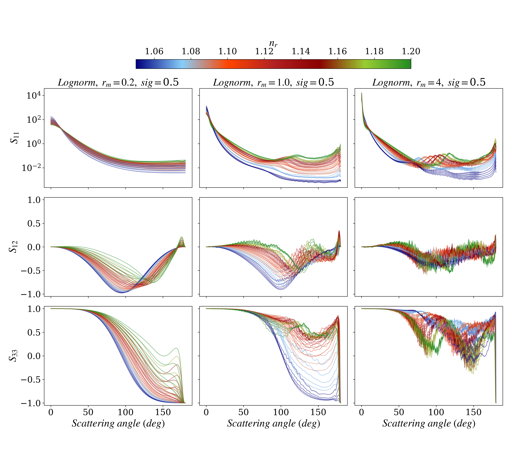

# Mie_perso
## Scientific code for fast mie computation based on PyMieScatt
## Getting Started


### Installation

First, clone [the repository](https://github.com/Tristanovsk/invRrs#), , and execute the following command in the
local copy:

```
pip install . 
```

This will install the package into the system's Python path.
If you have not the administrator rights, you can install the package as follows:

```
pip install -e .
```

### Examples

Check notebooks for basic examples. You could be able to reproduce massive computation and get scattering matrix for different size (or refractive index) distrubtions.

 
